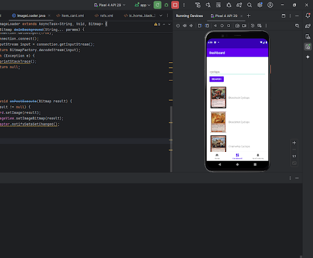
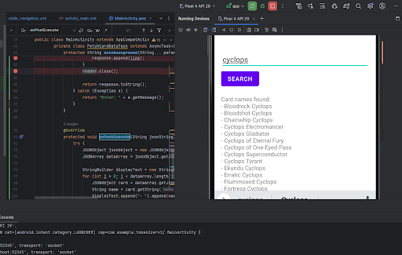
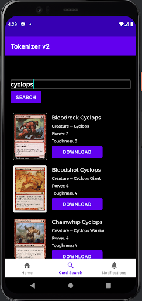

# Niketh Worklog

## Table of Contents

- [9/03/2024 ](<#90324---prep-for-first-ta-meeting>)

# 9/03/24

First brainstorm of Tokenizer, Jackson mentioned that this has been a passion project of his for a while now, and after getting our prior proposals rejected, Nathan and I were completely okay to go for this, even though we had no clue about the what the project actually solved since neither of us played Magic the Gathering.

## 9/12/24

Submitted proposal, started reading up on the parts Jackson wanted to use. Especially on the STM-32 vs ESP-32, and we needed USB capabilities so the STM would be a much better shout for usage. Heard Jackson mention E-ink vs LCD, so did some Googling on those too.

## 9/17/24

We prepped for the first TA meeting having completed our rudimentary block diagram. We sort of divided up work prior to this, so we’d have an idea going on who is doing what. I was going to be spearheading the app, as I have a lot of prior experience in Android development and backend development. Jackson was going to be doing the battery and PCB design, and Nathan would help both of us as he didn’t have a preference, and he was a great help in both and really helped with a lot of the documentation.

## 9/19/24

Finished the proposal and started working on the contract. Just needed to find some battery voltage equations for the proposal, and looked over how we would split work.

## 9/23/24

Started working on the design document, and here’s where a lot of the real research began. I was in charge of the “app” which kind of was just an idea up until I started doing research on how to do this. Jackson told me about an API called Scryfall, which contained Magic the Gathering information and data so I looked at its documentation. Debated Jackson about making the app iOS native or Android. My argument was that we should learn something new in using Apple so we would learn something new like using their IDE and Swift or C#, but Jackson’s more logical stance was that we would be treading into uncharted waters that none of us had any experience in whatsoever. We didn’t know how to use C# or Swift, what their IDE even entailed, and most importantly, how hard data transfers would be using USB in an iOS environment. So because of this, we decided to go with using Android Studio and an Android native app, something that I have almost 2 years of experience in. We also had an old phone we could use for demoing the app so it did end up working out.

## 10/02/24

Finished the design document, most of it was us talking about doing stuff in the future and some design choices we’d need to make for the project. Was kind of hard to try and describe all of these ideas into words on paper, but guess that’s why we’re ECE majors.

## 10/08/24

After long, we broke ground with the app. Created a repo and used a default 3-panel layout in Android Studio to get started. Started configuring buttons and UI on the search page first and added basic onClick functionality.

## 10/12/24

Achieved basic search functionality in the application using the Scryfall API. Used the user’s query from a search box and then appended search to an API call, pulled and unpackaged data to then neatly display it onto the screen.

## 10/14/24

Added on to this functionality by creating a LinearLayout containing a custom made window containing a couple of TextViews and an image. 

## 10/23/24

Whole new UI added into this and have a fully functional downloads tab as well as search tab. Maintain downloaded tokens in cart ready for exporting in the downloads tab, displaying the number of bytes in the token.

## 11/26/2024

Got the USB data transfer working thanks to Nathan. I had configured a byte array ready to be loaded onto the device but Nathan found that didn’t work so adopted a different technique in breaking it into chunks and then exporting the image.

## 12/4/2024

Finished the project for the most part, some glossing over to do. Created a .ppt and started working on it. Had our Final Demo. Went really well, everything functioned as intended and we were able to answer all of our questions.

## 12/06/2024

Mock Demo, presented to a non-technical person and got a lot of feedback about slides, delivery, and the overall presentation. Took those tips and fixed a lot of the slides and worked on delivery after the demo.

## 12/09/2024

Final Demo! Went really well in my opinion. Could have done better in going through some of the information but we took the tips given to our mock demo very well and did great.

## 12/11/2024

Writing this right now!

