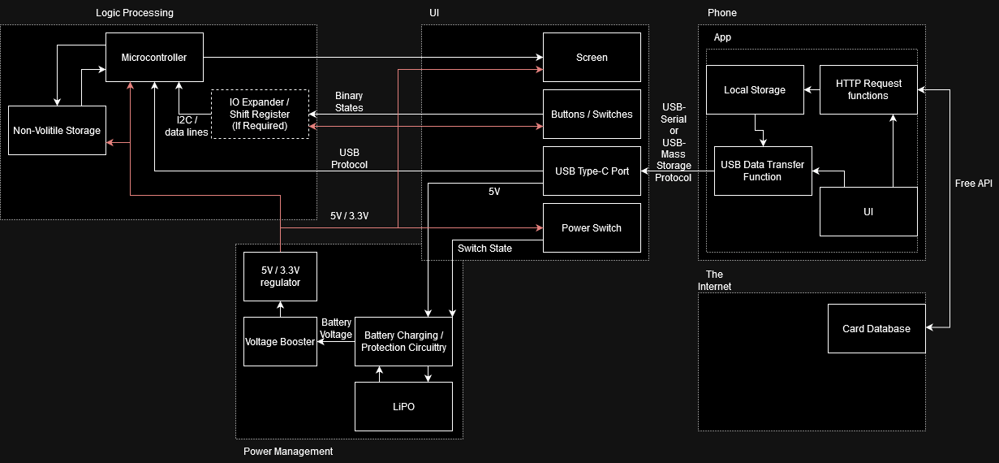
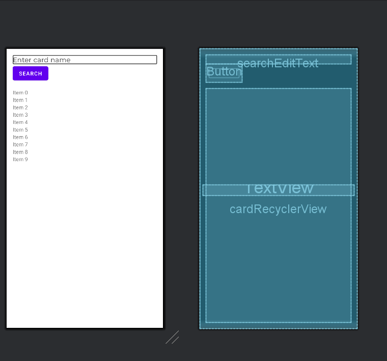
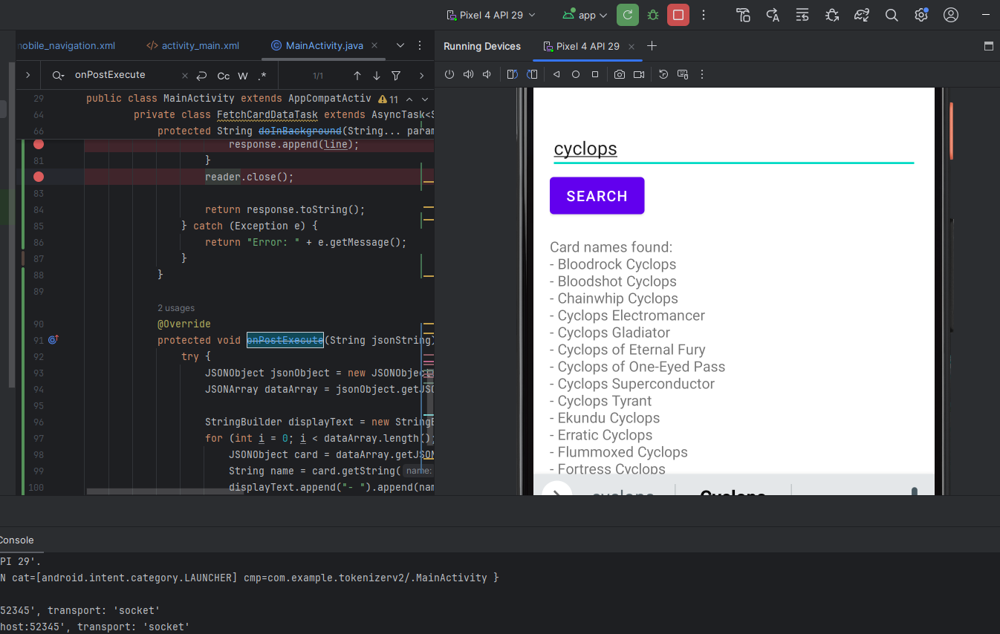
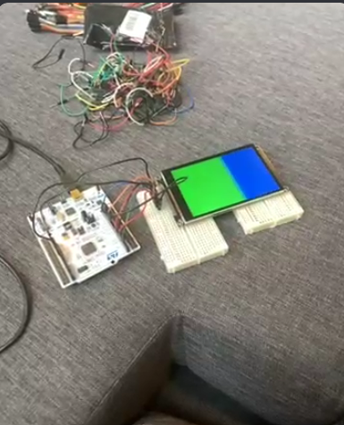
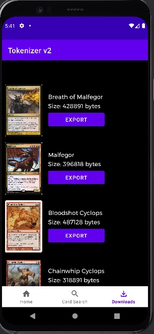

# Nathan Worklog

## Table of Contents
- [9/17/2024 - Discussion with TA](<#9172024---discussion-with-ta>)
- [9/23/2024 - Design Considerations](<#9232024---design-considerations>)
- [10/8/2024 - Initial Setup of the App](<#1082024---initial-setup-of-the-app>)
- [10/12/2024 - API querying with App](<#10122024---api-querying-with-app>)
- [10/14/2024 - Screen display](<#10142024---screen-display>)
- [10/23/2024 - Organization and Preparing for Export](<#10232024---organization-and-preparing-for-export>)
- [11/16/2024 - Adding Basic USB functionality](<#11162024---adding-basic-usb-functionality>)
- [11/23/2024 - Debugging USB](<#11232024---debugging-usb>)
- [11/26/2024 - Completed USB functionality](<#11262024---completed-usb-functionality>)
- [12/02/2024 - Final Testing and Adjustments](<#12022024---final-testing-and-adjustments>)

## 9/17/2024 - Discussion with TA

Discussed high level requirements of the project with the TA and explained all the subsystems and what functionalities they each entail. Created a block diagram and a visual aid showing what the design would look like (may be subject to change). 

## 9/23/2024 - Design Considerations

Started work on the design document and considered different approaches to the creation of The Tokenizer. Thought about using iOS vs Android for the companion app, but ended up opting for Android due to compatibility reasons and since our group had more familiarity with app development in Android Studio. Also had to consider using the memory embedded within the microcontroller vs. external storage such as a SD card. Unsure of what to do here but for now sticking to internal memory but this is subject to change. 

## 10/8/2024 - Initial Setup of the App

Began to create the layout of the app, starting with the general interface. Have not worked on querying the API database yet. Version control via a github repository will be used for collaboration of developing the app. Shown below is the layout of the  “search tab”.

## 10/12/2024 - API querying with App

Connection with the scryfall database has been established, users can now search up a token and see any related results after clicking the “search” button. The time it takes for results to show up after searching the query is almost instantaneous, which means that the 30 second requirement is easily met.

## 10/14/2024 - Screen display 

The display screen has been received and is confirmed to be working. Currently, it is only shown to display changing colors and not tokens as of yet due to the fact that USB transfer within the app has not been implemented yet. The screen size meets the high level requirements of having a 4.2 inch LCD display. The other requirement of being seen from 60 cm away cannot be tested yet as the token display is not functional. 

## 10/23/2024 - Organization and Preparing for Export

Adding a more comprehensive view of searched cards in the search tab, now showing the card image and its related attributes. Also added a download button within the search tab, that downloads the image as a byte array and the associated data such as power, toughness, name, text summary, etc. Once downloaded, it appears on the downloads tab. An “export” button exports the data to the microcontroller. As of now, the export button does not have any functionality, it just exists. 

## 11/16/2024 - Adding Basic USB functionality

Created a rough sketch for USB communication between the app and the device. Since our PCB design is not fully developed yet, there is no way to test this functionality. USB functionality cannot be tested on the emulated device native to Android Studio. Design flow includes sending all of the data through a bulkTransfer function and obtaining permissions via an imported Java library function. 

## 11/23/2024 - Debugging USB

After running an actual test on the USB code, it was found that it caused the app to crash. Mainly was an issue of how the app is handling USB permissions because it would not even make it to the bulkTransfer function. Tried a different approach to USB by using a different library and using write() and read() functions to send data when the microcontroller was ready to receive data. 

## 11/26/2024 - Completed USB functionality 

Able to finally complete USB functionality. Required a different approach to handling USB. Since the buffer of the microcontroller cannot receive the data all at once due to the file’s large size, it is sent in multiple smaller chunks. After some debugging it was found that there were a few issues, including setting a permission flag and other issues on the Android Studio end, device can now reliably receive data from the app. Conversion of image file format byte array to bmp was also necessary for image cropping so that the display on the device looks neater. 

## 12/02/2024 - Final Testing and Adjustments

Design is now essentially complete. The device has been tested by a few people and was found to be user friendly and created a neater view of the game state. Some extra things were added to improve the ease of access such as labels for the button that were drawn on with sharpie. 

