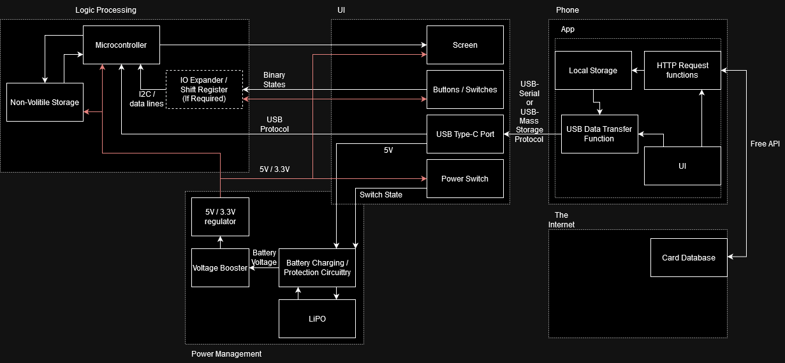

# Jackson Peterik (peterik3) Worklog

## Table of Contents

- [9/17/2024 - Prep for First TA Meeting](<#9/17/2024 - Prep for First TA Meeting>)
- [10/02/2024 - Component Search](<#10/02/2024 - Component Search>)
- [10/09/2024 - PCB Design Day 1](<#10/09/2024 - PCB Design Day 1>)
- [10/14/2024 - Testing Screen](<#10/14/2024 - Testing Screen>)
- [10/20/2024 - PCB Design Day 2](<#10/20/2024 - PCB Design Day 2>)
- [10/31/2024 - Reading Image from SD](<#10/31/2024 - Reading Image from SD>)
- [11/05/2024 - Order PCB and Parts](<#11/05/2024 - Order PCB and Parts>)
- [11/18/2024 - Assembly Day 1](<#11/18/2024 - Assembly Day 1>)
- [11/19/2024 - Assembly Day 2](<#11/19/2024 - Assembly Day 2>)
- [11/20/2024 - Device Testing](<#11/20/2024 - Device Testing>)
- [11/23/2024 - Battery Power Test](<#11/23/2024 - Battery Power Test>)
- [11/24/2024 - Firmware Development and Enclosure Design](<#11/24/2024 - Firmware Development and Enclosure Design>)
- [11/25/2024 - Battery Charger Replacement and Enclosure Printing](<#11/25/2024 - Battery Charger Replacement and Enclosure Printing>)
- [11/26/2024 - App Testing](<#11/26/2024 - App Testing>)
- [12/02/2024 - Final Testing](<#12/02/2024 - Final Testing>)

## 9/17/2024 - Prep for First TA Meeting

### High-Level Requirements

1. Clear and Crisp Display of Tokens: The screen should display individual tokens, groups of tokens, and updates to token attributes (e.g., power, toughness, counters).
    - Token's art should be differentiable from a distance of 1m.
2. Real-Time Interaction: Players should be able to add or remove tokens and update token statuses in real time using physical buttons without needing to pause the game or access the app.
    - Changes to card details should be visible within 1 second of the buttons being pressed.
3. Seamless Data Transfer: The mobile app should efficiently transfer token images and game data to the device via USB-C, with minimal setup time.
    - Transferring 10 unique cards along with their attributes should take no longer than 2 minutes.

### Per Subsystem Requirements

- Microcontroller:
    - The device should be able to store the data for 10 token types, the attributes for 16 unique tokens per token type, and up to 255 identical copies per token.
    - Data should not be lost on power off
- Power Management:
    - Battery circuitry should maintain safe maximum and minimum voltages, and follow the correct charging curve
    - Battery capacity should allow for 4 hours of continuous use.
    - Boosting and regulating should keep the output voltage stable while battery voltage dips below the regulated voltage
- App:
    - Selecting a card should be able to be done by somebody who has never used the app before
- IO:
    - Buttons should have a tactile feel, and be debounced.
    - Screen brightness should be adjustable.

## 10/02/2024 - Component Search

- [Microcontroller](https://www.st.com/resource/en/datasheet/stm32f103rg.pdf): STM32F1 series: hardware
- [Battery Charger](https://www.ti.com/lit/ds/symlink/bq25185.pdf): BQ25185: Small, powerpath
- [Screen](http://www.lcdwiki.com/4.0inch_Capacitive_SPI_Module_ST7796): Hoysond 4.0inch Capacitive SPI Module ST7796: has sd built in, spi communication, reasonable size when including bezels

I ordered a screen for testing and am waiting for the PCB to be designed before ordering more parts.

Resources:

- [Battery charger ICs product selection | TI.com](https://www.ti.com/battery-management/charger-ics/products.html)
- [Which is your favorite Battery Charging and Protection IC for Lithium Battery? : r/embedded](https://www.reddit.com/r/embedded/comments/1c180l2/which_is_your_favorite_battery_charging_and/)
- [Popular Battery Charger ICs for Lithium Battery Charging and Protection](https://components101.com/articles/how-to-select-the-right-battery-charging-ic)
- [Battery management ICs | TI.com](https://www.ti.com/battery-management/overview.html)
- [Battery management ICs product selection | TI.com](https://www.ti.com/battery-management/products.html)
- [Hosyond – LCD & Arduino Kit & Raspberry Pi](https://hosyond.com/)
- [4.0inch Capacitive SPI Module ST7796 - LCD wiki](http://www.lcdwiki.com/4.0inch_Capacitive_SPI_Module_ST7796)

## 10/09/2024 - PCB Design Day 1

Used reference design from the [wiki](https://courses.grainger.illinois.edu/ece445/wiki/#/stm32_example/index) to design the basics for the board, finishing the boot selector, HF crystal, and debug, as well as decoupling caps.

## 10/14/2024 - Testing Screen

Used the Nucleo dev board to test the toolchain for development, as well as the screen: used example Arduino code, and STMDuino with the Arduino IDE.

Resources:

- [NUCLEO-F401RE | Mbed](https://os.mbed.com/platforms/ST-Nucleo-F401RE/)
- [STSW-LINK009 - ST-LINK, ST-LINK/V2, ST-LINK/V2-1, STLINK-V3 USB driver signed for Windows7, Windows8, Windows10 - STMicroelectronics](https://www.st.com/en/development-tools/stsw-link009.html?dl=9RmdogSPxO7L%2Bqry89kmHQ%3D%3D%2C1V%2FCTo8infzV%2Fyd42yEOEQPTUZQZOpaDmqPPmxMKP3nhXNA5YTgvCgitJNHAdvfB%2FmJLi%2F0GblyK%2FigbaHhoVZM0LNoDuNPJvQ15Un7u%2BDW0q56X75dHhVXUmEGiNdJT4UOL144NOm0pNg%2BOjm%2FuXjsb5ZhISMO4E7%2FtqCmoVNF5fKsi1nLZj5MbpeOQcKXsT%2Bxyg8flfDEsJeqRYUoepz68bMRY3SOn0tAFPUfg96wX%2F%2FeO7wIQBEsmhtloVucp5ZVMoPnCQ0eJcRjYDeiXwIODGR16GpLn2d%2FeGDZuS0BEj8cbzcLwvnLZruRZ9%2FAL&mkt_tok=ODU2LVBWUC03MTUAAAGWK7GPEMtEnD0VdC4yd_NPSYZzMSVlENnbsXVkVcnTbLWIxJup-wOBhMPFqsq8wD55GOkFv6jMusbvgTXix-40PDQOIA3torOvbFgpYNEZ2w)
- [FAQ · stm32duino/Arduino_Core_STM32 Wiki · GitHub](https://github.com/stm32duino/Arduino_Core_STM32/wiki/FAQ)
- [Home · stm32duino/Arduino_Core_STM32 Wiki · GitHub](https://github.com/stm32duino/Arduino_Core_STM32/wiki)

## 10/20/2024 - PCB Design Day 2

Used datasheets for battery charger, microcontroller, and screen to finalize pin location

## 10/31/2024 - Reading Image from SD

The general screen UI layout was designed and implemented, but sometimes when uploading, the code would not be transfered to the device. After debugging, I discovered the issue was that the default upload method for STMduino was not great, and switched to using the stlink driver, which solved the issue.

Resources:

- [GitHub - greiman/SdFat: Arduino FAT16/FAT32 exFAT Library](https://github.com/greiman/SdFat)
- [GitHub - prenticedavid/Adafruit_ST7796S_kbv: Adafruit-style library for ST7796S SPI displays](https://github.com/prenticedavid/Adafruit_ST7796S_kbv)
- [Overview | Adafruit GFX Graphics Library | Adafruit Learning System](https://learn.adafruit.com/adafruit-gfx-graphics-library?view=all)
- [Loading Images | Adafruit GFX Graphics Library | Adafruit Learning System](https://learn.adafruit.com/adafruit-gfx-graphics-library/loading-images)
- [Upload methods · stm32duino/Arduino_Core_STM32 Wiki · GitHub](https://github.com/stm32duino/Arduino_Core_STM32/wiki/Upload-methods)

## 11/05/2024 - Order PCB and Parts

Submitted PCB to JLCPCB and PCBWay, ordered parts from Digikey, and submitted a request for parts from

## 11/18/2024 - Assembly Day 1

Used soldering oven to attach most components, and used hot air to fix many bridges and incomplete melting on larger ground pads.

## 11/19/2024 - Assembly Day 2

After probing around, I saw many strange connections being made and realized that the STM32 was in the wrong orientation. I used a hot air gun to desolder it, and turned it to the correct orientation.

I also ordered the battery, as it was not ordered originally due to limiting shipping options.

Resources:

- [(3) Replacing Flight Controller STM32 Processor - YouTube](https://www.youtube.com/watch?app=desktop&v=vFLg-vSsbk4&t=0s)

## 11/20/2024 - Device Testing

Tested functionality of all components of the system:

- Microcontroller
  - Gets power, responds to programming over stlink
- Battery Charger
  - Passes power from USB to regulator
- Regulator
  - Wrong regulator was ordered, 1.5V vs 3.3V. Device will not turn on when powered by USB like this, ordered a replacement.
- Buttons
  - Microcontroller can detect pressing of buttons
- Screen
  - Screen did not behave correctly. After probing, realized that the included FPC cable had the conductos exposed on opposite faces of the cable, resulting in pin 1 of the pcb side connecting to pin 14 on the screen side.
  - To resolve, I cut the cable shorter, and shaved away the plastic with an knife on the same face in order to expose the wires, which worked and the screen sprung to life.

## 11/23/2024 - Battery Power Test

Plugged in the battery, which immediatly destroyed the battery charging chip. In the schematic, we had gotten the battery terminals swapped, so having a -4.2 Voltage from input to ground fried the chip. Luckily, the rest of the circuit was disconnected, so it was the only casualty. I ordered a new chip to be overnight shipped, as well as a hot air station as I was at home and could not access the lab.

## 11/24/2024 - Firmware Development and Enclosure Design

Worked on implementing more features on the device, such as holding multiple tokens, USB transfer, and more complex control of the token data.

Some issues encountered include the USB clock not using the oscilator as its source, causing instabillity, as well as the inline 22 ohm resistors causing some issues. Replacing the resistors with a small wire as a jumper, as well as configuring the device using STM32CubeMX to use correct clock.

Started designing the enclosure in Fusion 360, using the screen dimensions and the PCB dimensions to create a case that would fit the device. As my brother is a mechanical engineer, I asked him for help with the design, and he gave me some tips on how to make the case more manufacturable.

Resources:

- [STM32 USB Full Speed device: Do you need termination resistors? - Electrical Engineering Stack Exchange](https://electronics.stackexchange.com/questions/649314/stm32-usb-full-speed-device-do-you-need-termination-resistors)
- [Introduction to USB hardware and PCB guidelines using STM32 MCUs - Application note - en.DM00296349.pdf](https://www.st.com/content/ccc/resource/technical/document/application_note/group0/0b/10/63/76/87/7a/47/4b/DM00296349/files/DM00296349.pdf/jcr:content/translations/en.DM00296349.pdf)

## 11/25/2024 - Battery Charger Replacement and Enclosure Printing

Replaced the battery charger chip as well as the regulator, as well as removing and rotating the battery connector to the correct orientation. The device now powers on and charges the battery correctly. The device now can run without the external power supply, just using USB, and when unplugged, the battery takes over. The device can also charge the battery when plugged in.

Printed the enclosure using my personal 3D printer, and overall the case fits the device well. The button extensions had to be printed a few times to get the correct size, but overall the device fits well in the case.

## 11/26/2024 - App Testing

Tested the app on the device, and found that the device was not correctly communicating with the app. After some debugging, Nathan and I found that there were several issues, including a missing permission flag when requesting USB access, as well as all the messages being too large for the buffer. After fixing these issues, the app was able to communicate with the device and send images and data.

Resources:

- [USB communications device class - Wikipedia](https://en.wikipedia.org/wiki/USB_communications_device_class)
- [STM32CubeMX - STM32Cube initialization code generator - STMicroelectronics](https://www.st.com/en/development-tools/stm32cubemx.html#documentation)
- [Run apps on a hardware device  |  Android Studio  |  Android Developers](https://developer.android.com/studio/run/device#setting-up)
- [Bitmap  |  Android Developers](https://developer.android.com/reference/android/graphics/Bitmap#createScaledBitmap(android.graphics.Bitmap,%20int,%20int,%20boolean))

## 12/02/2024 - Final Testing

Did some final polishing on the firmware, and used a sharpie to draw icons on the buttons. The device was then tested by a few friends, and they all found it easy to use and understand.
